# Calc service

## Описание проекта
<b>Calc service</b> — это проект, реализованный на языке программирования Golang, который предназначен для вычисления арифметических выражений, таких как "(6+(2+2)*2)/10". Главная цель этого сервиса заключается в том, чтобы предоставить возможность быстро и точно обрабатывать математические выражения, которые могут включать в себя различные операции, такие как сложение, вычитание, умножение и деление, а также выражения со скобками.

## Настройка
1. Клонируйте репозиторий:

```sh
git clone https://github.com/DobryySoul/Calc-service.git
```
2. Перейдите в корневую папку проекта, если это не было еще сделано:
```sh
cd Сalc-service
```

3. Установите зависимости:
```sh
go mod tidy
```

Отлично, это уже успех! Если вы хотите изменить параметры конфигурации проекта, то продолжите чтение, если же нет, то переходите на следующий [этап](#Запуск).

## Конфигурация 
Сервис можно настроить с помощью переменных среды. Со списком и описанием доступных параметров к настройке можно ознакомиться [здесь](#Список-параметров-конфигурации). 

Чтобы указать параметры переменной среды, который вы хотите использовать, необходимо изменить файл [.env](https://github.com/DobryySoul/Calc-service/blob/main/.env), иначе сервер будет запущен на дефолтых значения, которые указаны в этом файле.

Также есть возможность указать значения переменных среды через команды в терминале, пример:
### Windows

```sh
$env:PORT=порт
```

### Linux и macOS

```sh
export PORT=порт
```

## Endpoints

Сервис имеет следующий эндпоинты:
- `/api/v1/calculate` - отправить новое выражение для вычисления.
- `/api/v1/expressions` - получить список всех выражений.
- `/api/v1/expression/:id` - получить выражение по идентификатору id[^1].
- `/internal/task` - получить задачу для обработки/отправить результат.

    - GET: отдает задачу на выполнение.

    - POST: отправляет результат выполнения. 
    ```json
    {
        "id": уникальный идентификатор,
        "result": результат вычислений
    }
    ```

## Запуск

Проект готов к запуску.

Бэкенд делиться на 2 части:
1. Оркестратор

2. Агент

Команды, чтобы запустить их:
1. ```sh
    go run cmd/orchestrator/main.go
    ```

2. ```sh
    go run cmd/agent/main.go
    ```

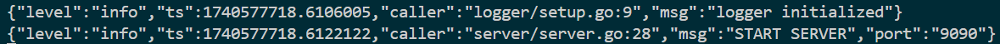

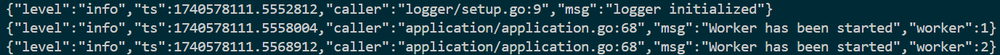

Мои поздравления! Сервис успешно запущен и готов к функционированию.


## Список параметров конфигурации

#### `port`

*(номер)* Порт для запуска приложения.

- Эквивалент env: `PORT`.

#### `time_addition_ms`
*(продолжительность)* время выполнения операции сложения в миллисекундах

- Эквивалент env: `TIME_ADDITION_MS`.

#### `time_subtraction_ms`
*(продолжительность)* время выполнения операции вычитания в миллисекундах

- Эквивалент env: `TIME_SUBTRACTION_MS`.

#### `time_multiplications_ms`
*(продолжительность)* время выполнения операции умножения в миллисекундах

- Эквивалент env: `TIME_MULTIPLICATIONS_MS`.

#### `time_divisions_ms`
*(продолжительность)* время выполнения операции деления в миллисекундах

- Эквивалент env: `TIME_DIVISIONS_MS`.

#### `computing_power`
*(продолжительность)* количество независимых вычислителей(горутин)

- Эквивалент env: `COMPUTING_POWER`.

## Обработка запросов и ошибок

### Статус коды
В зависимости от типа запроса, а также корректности выражения, сервер дает различные ответы, с соответствующими статус кодами:

`/api/v1/calculate`

- `201`: Ответ на добавление выражения для вычисления в верном формате:

```json
{
    "expression": "2 + 2 * 15" // аримфметическое выражение верного формата -> string
}
```
  
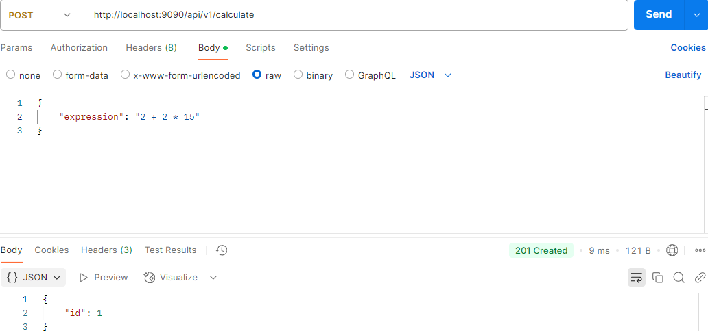

- `422`: Ошибка в арифметическом выражении, невалидный формат, пример: 

```json
{
    "expression": "2 + 2 * 15
}
```

#### `/api/v1/expressions`

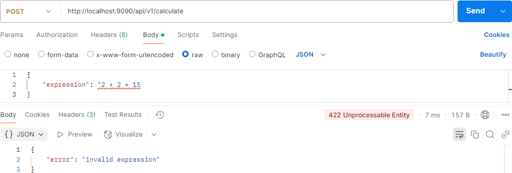

- `200`: Успешно получен список выражений:

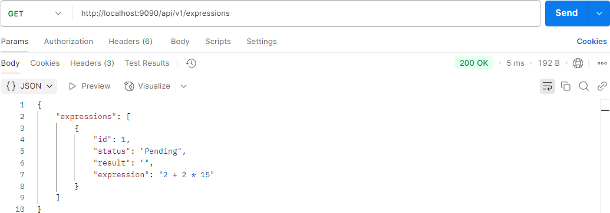


[^1]: `/api/v1/expressions`


- `200`: Успешно полученное выражение по идентификатору id:

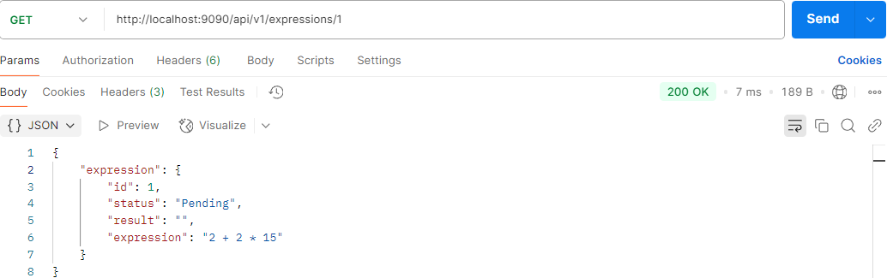

- `404`: Выражение не было найдено по id:

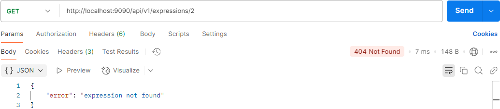

- `200`: Задача успешно получена:
  
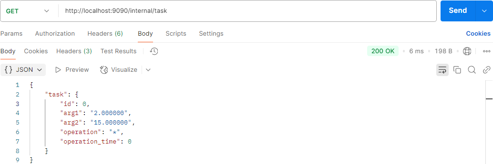

- `404`: Нет задач для выполнения:
  
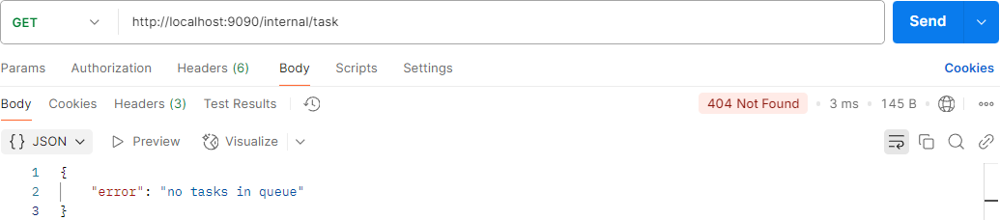


- `200`: Успешно записан результат задачи в формате 

```json
{
    "id": 0, // индектификатор задачи -> int
    "result": 30 // валидный формат ответа-> int
}
```
  
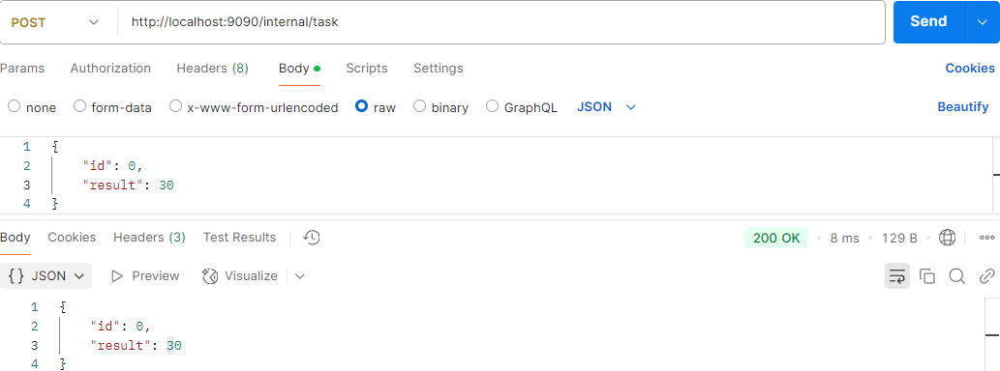
 
- `404`: По данному id не было найдено задачи.

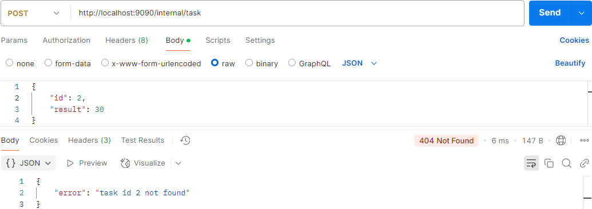

- `422`: Невалидный формат введенных данных, пример:

```json
{
    "id": 0, // идентификатор задачи -> int
    "result": "30" // невалидный формат ответа -> string
}
```

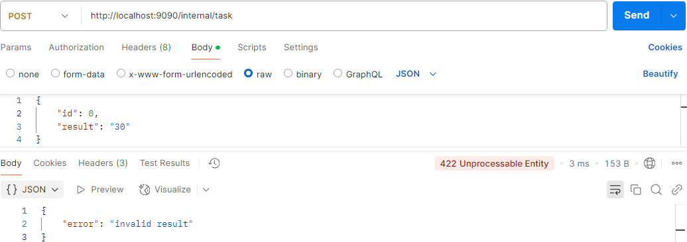

- `500`: Случай внутренней ошибки сервера. Данная ошибка не возникает, так как сервер работает полностью исправно, но все же данная ошибка должна обрабатываться, на случай, когда сервер не сможет обработать запрос к сайту или дать ответ.
 