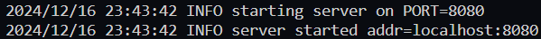
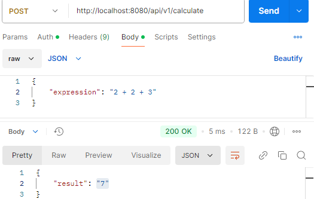
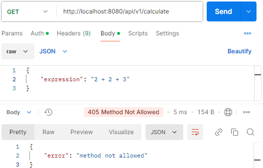

# Calc service

## Описание проекта
<b>Calc service</b> — это проект, реализованный на языке программирования Golang, который предназначен для вычисления арифметических выражений, таких как "(6+(2+2)*2)/10". Главная цель этого сервиса заключается в том, чтобы предоставить возможность быстро и точно обрабатывать математические выражения, которые могут включать в себя различные операции, такие как сложение, вычитание, умножение и деление, а также выражения со скобками.

## Настройка
Клонируйте этот репозиторий:

```sh
git clone https://github.com/DobryySoul/Calc-service.git
```
И перейдите в корневую папку проекта, если это не было еще сделано:
```sh
cd calc-service
```

Мы почти готовы запустить приложение, но сначала нам нужно выполнить некоторые настройки конфигурации.

## Конфигурация 
Сервис можно настроить с помощью переменных среды. Со списком и описанием доступных параметров к настройке можно ознакомиться [здесь](#Список-параметров-конфигурации). 

Чтобы указать параметры переменной среды, который вы хотите использовать, необходимо изменить файл [.env](https://github.com/DobryySoul/Calc-service/blob/main/.env): `ADDR`:
### Windows

```sh
$env:ADDR=порт
```

### Linux и macOS

```sh
export ADDR=порт
```

## Эндпоинты

Сервис имеет следующий эндпоинт с url-ом:
- `/api/v1/calculate` - отправить новое выражение для вычисления
- `/api/v1/expressions` - получить список всех выражений
- `/api/v1/expression/:id` - получить выражение по идентификатору id
- `/internal/task` - получить задачу для обработки/отправить результат

    GET: отдает задачу на выполнение

    POST: отправляет результат выполнения 
    ```json
    {
        "id": уникальный идентификатор, 
        "result": "результат вычислений"
    }
    ```

## Установка и запуск

После установки переменной среды, сервис может быть успешно запущен на указанном порту следующей командой в терминале:

```sh
go run ./cmd/orchestrator/main.go
```



<strong>Примечание!!! Если вы не указали порт и запустили проект, то сервис будет запущен на default значении порта ":8080".</strong>

Мои поздравления! Сервис был успешно запущен и готов к функционированию по адресу `http://localhost:8080/api/v1/calculate` (в данном случае порт не был указан).

## Список параметров конфигурации

#### `port`

*(номер)* Порт для запуска приложения.

- Эквивалент env: `PORT`.

#### `time_addition_ms`
*(продолжительность)* время выполнения операции сложения в миллисекундах

- Эквивалент env: `TIME_ADDITION_MS`.

#### `time_subtraction_ms`
*(продолжительность)* время выполнения операции вычитания в миллисекундах

- Эквивалент env: `TIME_SUBTRACTION_MS`.

#### `time_multiplications_ms`
*(продолжительность)* время выполнения операции умножения в миллисекундах

- Эквивалент env: `TIME_MULTIPLICATIONS_MS`.

#### `time_divisions_ms`
*(продолжительность)* время выполнения операции деления в миллисекундах

- Эквивалент env: `TIME_DIVISIONS_MS`.

#### `computing_power`
*(продолжительность)* количество независимых вычислителей(горутин)

- Эквивалент env: `COMPUTING_POWER`.

## Обработка запросов и ошибок

### Статус коды
В зависимости от типа запроса, а также корректности выражения, сервер дает различные ответы, с соответствующими статус кодами:

- `200`: Ответ на успешный запрос вида `{"expression": "аримфметическое выражение верного формата"}`
  


- `405`: Ответ на иной тип запроса, кроме POST
  


- `422`: Ошибка в арифметическом выражении, например: `{"expression": "2 + 2 * (2 * 3"}`, более подробно с ошибками, которые могут возникать с выражениями вы можете ознакамливаться в логах или по ссылке в [файле с ошибками](pkg/calculation/errors.messages.go)


 
- `500`: Случай внутренней ошибки сервера. Данная ошибка не возникает, так как сервер работает полностью исправно, но все же данная ошибка должна обрабатываться, на случай, когда сервер не сможет обработать запрос к сайту.
 