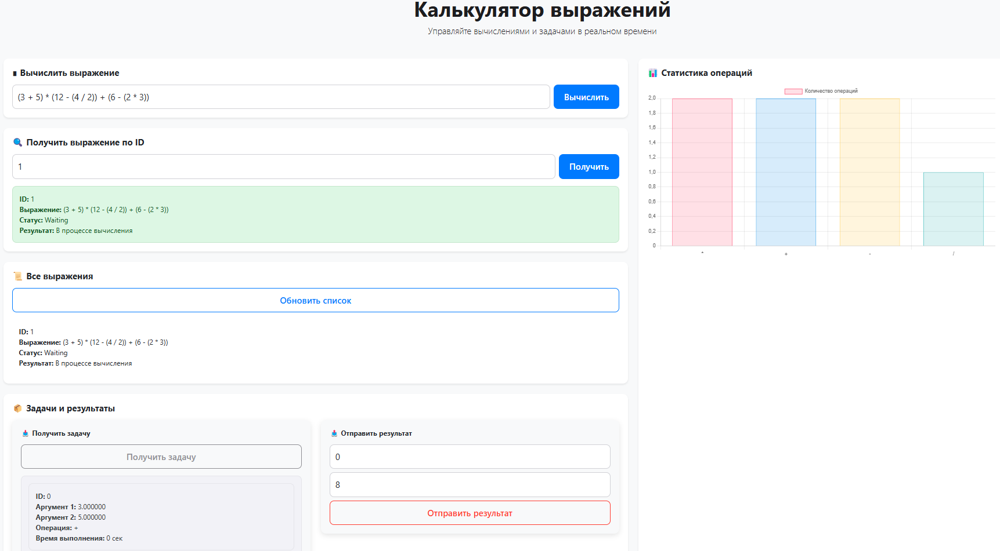

# Calc service

## Описание проекта
<b>Calc service</b> — это проект, реализован на языке программирования Golang, предназначен для вычисления арифметических выражений, таких как "(6+(2+2)*2)/10". Главная цель этого сервиса заключается в том, чтобы предоставить возможность быстро и точно обрабатывать математические выражения, используя параллельые вычисления. Калькулятор автоматически разбивает выражение на задачи и параллельно производит вычисления.


## Схема работы проекта

Прикладываю для вас схему, для наглядного описания, как происходит взаимодействие.


## Настройка
1. Клонируйте репозиторий:

```sh
git clone https://github.com/DobryySoul/Calc-service.git
```
2. Перейдите в корневую папку проекта, если это не было еще сделано:
```sh
cd Сalc-service
```

3. Установите зависимости:
```sh
go mod tidy
```

Отлично, это уже успех! Если вы хотите изменить параметры конфигурации проекта, то продолжите чтение, если же нет, то переходите на следующий [этап](#Запуск).

## Конфигурация 
Сервис можно настроить с помощью переменных среды. Со списком и описанием доступных параметров к настройке можно ознакомиться [здесь](#Список-параметров-конфигурации). 

Чтобы указать параметры переменной среды, который вы хотите использовать, необходимо изменить файл [.env.example](https://github.com/DobryySoul/Calc-service/blob/main/.env) на .env и изменить переменные, иначе сервер будет запущен на дефолтных значениях, которые указаны в этом файле.

Также есть возможность указать значения переменных среды через команды в терминале, пример:
### Windows

```sh
$env:PORT=порт
```

### Linux и macOS

```sh
export PORT=порт
```

## Endpoints

Сервис имеет следующий эндпоинты:
- `/api/v1/calculate` - отправить новое выражение для вычисления.
- `/api/v1/expressions` - получить список всех выражений.
- `/api/v1/expression/:id` - получить выражение по идентификатору id.
- `/internal/task` - получить задачу для обработки/отправить результат.

    - GET: отдает задачу на выполнение.

    - POST: отправляет результат выполнения. 
    ```json
    {
        "id": уникальный идентификатор,
        "result": результат вычислений
    }
    ```

## Запуск

Проект готов к запуску.

Бэкенд делиться на 2 части:
1. Оркестратор

2. Агент

Команды, чтобы запустить их:
1. ```sh
    go run cmd/orchestrator/main.go
    ```

2. ```sh
    go run cmd/agent/main.go
    ```


Мои поздравления! Сервис успешно запущен и готов к функционированию.


## Список параметров конфигурации

#### `host`

*(адрес)* Адрес для запуска приложения.

- Эквивалент env: `HOST`.

#### `port`

*(номер)* Порт для запуска приложения.

- Эквивалент env: `PORT`.

#### `time_addition_ms`
*(продолжительность)* время выполнения операции сложения в миллисекундах

- Эквивалент env: `TIME_ADDITION_MS`.

#### `time_subtraction_ms`
*(продолжительность)* время выполнения операции вычитания в миллисекундах

- Эквивалент env: `TIME_SUBTRACTION_MS`.

#### `time_multiplications_ms`
*(продолжительность)* время выполнения операции умножения в миллисекундах

- Эквивалент env: `TIME_MULTIPLICATIONS_MS`.

#### `time_divisions_ms`
*(продолжительность)* время выполнения операции деления в миллисекундах

- Эквивалент env: `TIME_DIVISIONS_MS`.

#### `computing_power`
*(продолжительность)* количество независимых вычислителей(горутин)

- Эквивалент env: `COMPUTING_POWER`.

## Обработка запросов и ошибок

### Статус коды
В зависимости от типа запроса, а также корректности выражения, сервер дает различные ответы, с соответствующими статус кодами:

> [!IMPORTANT]
> #### `/api/v1/calculate`

- `201`: Ответ на добавление выражения для вычисления в верном формате:

```json
{
    "expression": "2 + 2 * 15" // аримфметическое выражение верного формата -> string
}
```
  


- `422`: Ошибка в арифметическом выражении, невалидный формат, пример: 

```json
{
    "expression": "2 + 2 * 15
}
```


> [!IMPORTANT]
> #### `/api/v1/expressions`

- `200`: Успешно получен список выражений:


> [!IMPORTANT]
> #### `/api/v1/expressions/:id`


- `200`: Успешно полученное выражение по идентификатору id:


- `404`: Выражение не было найдено по id:


> [!IMPORTANT]
> #### `/internal/task`

- `200`: Задача успешно получена:
  


- `404`: Нет задач для выполнения:
  


- `200`: Успешно записан результат задачи в формате 

```json
{
    "id": 0, // идентификатор задачи -> int
    "result": 30 // валидный формат ответа-> int
}
```
  

 

- `404`: По данному id не было найдено задачи.


- `422`: Невалидный формат введенных данных, пример:

```json
{
    "id": 0, // идентификатор задачи -> int
    "result": "30" // невалидный формат ответа -> string
}
```


- `500`: Случай внутренней ошибки сервера. Данная ошибка не возникает, так как сервер работает полностью исправно, но все же данная ошибка должна обрабатываться, на случай, когда сервер не сможет обработать запрос к сайту или дать ответ.

## Frontend

Перейдя в браузере по адресу http://localhost:9090 (если запускали на дефолтном значении переменных окружения), вы попадете на внешний интерфейс сервиса


1. Форма для отправки нового выражения на сервер.
2. Кнопка `Вычислить` отправляет выражение на бэкенд, для дальнейшего взаимодействия с ним.


3. Форма для ввода id выражения, информацию о котором вы хотите получить.
4. Кнопка `Получить` непостредственно запрашивает информацию о выражении с введенным id, если такое выражение существует, то оно будет выведено.


5. Кнопка для обновления списка всех выражений. Несмотря на то, что сайт сам обновляется при получении нового выражения на вычисление, если выражения будут посчитаны кем-то, например, агентами, то необходимо будет нажать `Обновить список`, для вывода актульной информации.


6. Извлекает задачу из выражения и отправляет ее вам для подсчета.


7. Сюда необходимо вставить id актуальной задачи.
8. Результат ваших вычислений.
9. Кнопка взаимодействия(отправки результата на сервер).


10. Форма отображения статистики, статистика ведется по количеству выполняемых операций, информация собирается в момент отправки выражений на сервер, когда они поступают на бэкенда, для отображения информации нажмите `F5`. При необходимости ее можно скрыть нажав на `Количество операций`.


> [!TIP]
> ### Как это все может выглядеть в совокупности


